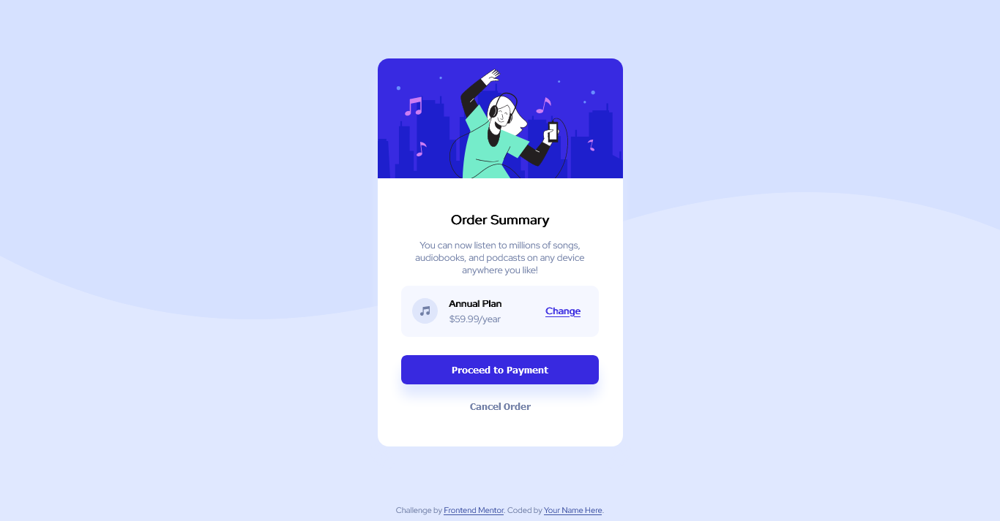

# Frontend Mentor - QR code component solution

This is a solution to the [Order Summary component main challenge on Frontend Mentor](https://driespindola.github.io/Front-End-Mentor-Challenge-Order-Summary-using-HTML-and-CSS/). Frontend Mentor challenges help you improve your coding skills by building realistic projects. 

## Table of contents

- [Overview](#overview)
  - [Screenshot](#screenshot)
  - [Links](#links)
- [My process](#my-process)
  - [Built with](#built-with)
  - [What I learned](#what-i-learned)
  - [Continued development](#continued-development)
  - [Useful resources](#useful-resources)
- [Author](#author)

## Overview

### Screenshot




### Links

- Live Site URL: [Github](https://driespindola.github.io/Frontend-Mentor-Challenge-QR-Code-Using-HTML-and-CSS/)

## My process

### Built with

- Semantic HTML5 markup
- CSS custom properties
- Flexbox
- CSS Grid
- Mobile-first workflow

### What I learned


```
.card {
    display: flex;
    flex-wrap: wrap;
    justify-content: center;
    align-items: center;
    max-height: 534px;
    width: 335px;
    margin-top: 80px;
    margin-bottom: 80px;
    margin-left: auto;
    margin-right: auto;
    background: white;
    border-radius: 15px;
    box-shadow: 0px 20px 12px hsl(225, 100%, 94%);
}
```
```
.header-img {
    width: 100%;
    object-fit: cover;
    border-top-left-radius: 15px;
    border-top-right-radius: 15px;
}
```
```
.payment {
    display: flex;
    align-items: center;
    width: 270px;
    height: 70px;
    background-color: hsl(225, 100%, 98%);
    border-radius: 10px;
    font-size: 13px;
}
```
```
 <main class="card">
    
    <h1> Order Summary </h1>
    <p>You can now listen to millions of songs, audiobooks, and podcasts on any device anywhere you like!</p>
    <section class="payment">
      
      <ul>
        <li><b>Annual Plan</b></li>
        <li>$59.99/year</li>
      </ul>  
      <a href="#"> Change </a>    
    </section>
    <button type="button" id="payment">Proceed to Payment</button>
    <button type="button" id="cancel">Cancel Order</button>
  </main>
```

### Continued development

I want to get better at UI/UX design, create box shadows and starts commenting more on my code. I still feel the need to train more flexbox, despite getting better I still struggle.


### Useful resources

- [W3Schools](https://www.w3schools.com) - It's a great site containing resourses for HTML, CSS and JS.
- [Figma](https://www.figma.com/) - Great for finding design inspiration.


## Author

- Github - [Driespindola](https://www.your-site.com)
- Frontend Mentor - [@driespindola](https://www.frontendmentor.io/profile/driespindola)
- Twitter - [@_driespindola](https://twitter.com/_driespindola)